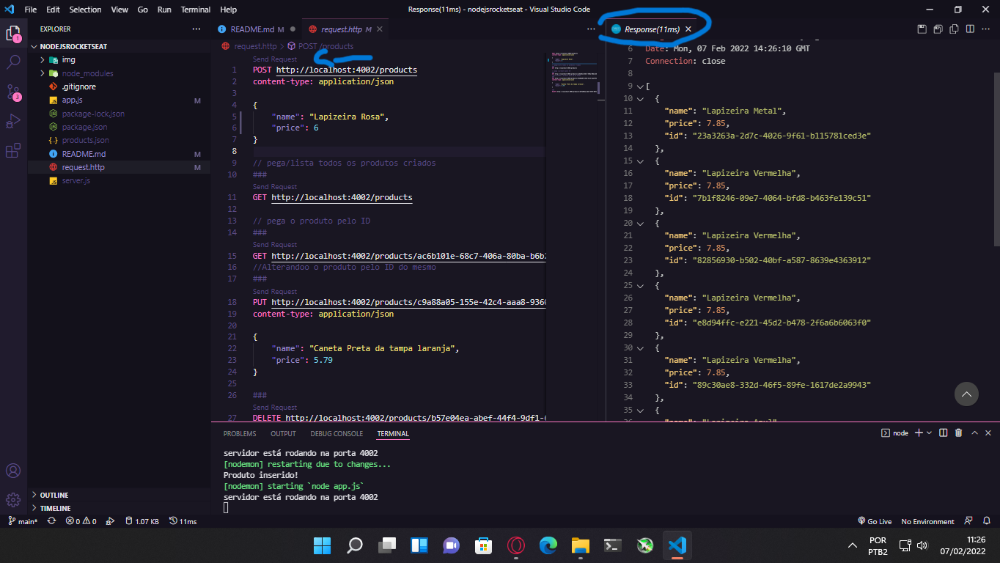
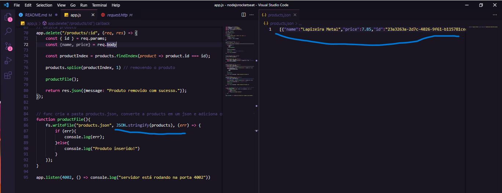
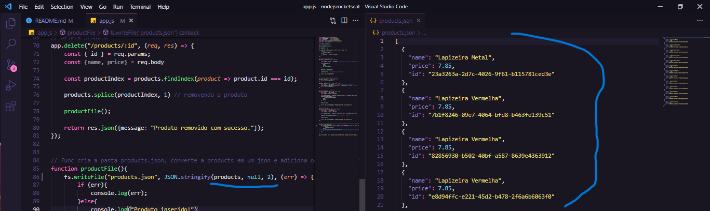

# MEU PRIMEIRO CRUD-API COM NODE.JS

 

- esse é a minha primeira API com Node.js onde ela faz o famoso CRUD.
- Essa API eu não fiz só, entretanto, irei modificar algumas coisas nela aos poucos, no momento apenas fiz de acordo com o Video da Rocketseat no Youtube.
- Link: <a href="https://www.youtube.com/watch?v=fm4_EuCsQwg&list=LL&index=2&t=2948s">COMEÇANDO COM NODE.JS EM 2022 - ROCKETSEAT</a>
- no Link acima você poderá fazer o mesmo, ficando assim de melhor entendimento o que cada linha faz, e é claro como preparar o ambiente, pois antes você precisará instalar por exemplo o NODE.JS e o npm.

## Bastante aprendizado

- Acompanhar a professora escrevendo esse código e replicando do lado de cá foi bastante satisfatorio, liberou dopamina no meu cérebro e me fez despertar ideias. inclusive achei mais legal de mexer com web com o Node.js pelo pouco que vi do que com o DJANGO (sem querer desmerecer meu querido e amado Python rsrsrs)

## Sobre a API

- Bom, não tem muito o que se dizer, afinal é um CRUD. um fato interessante foi que salvamos os dados em arquivo JSON, ele escreve, altera e deleta os dados de acordo com o que você faz.
- Ele também salva o arquivo fazendo com que mesmo que você pare o servidor http, ele após reiniciado volte ao estado com os dados da ultima forma salva. simulando assim um Banco de dados.

## JSON Melhor de se ler

- Bom, antes ao salvar o JSON contendo os dados que criamos na request.http ele estava colocando tudo em uma única linha, tornando inviável de se ler.
-Perguntei a algumas pessoas se tinha como quebrar as linhas do JSON para que ele fica da mesma forma que a response retorna quando enviamos um parametro:

 

- com isso, se não passarmos os parametros null e 2 após a chamar a var no JSON.STRINGFY no arquivo salvo ira dessa forma:

 

- feito isso, passei os parametros após ter visto um video sobre JSON do otavio miranda no youtube > Link: <a href="https://www.youtube.com/watch?v=XmCrArtfjaQ&t=15s">JSON - LUIZ OTAVIO</a>
 

- Então esse foi o resultado adicionando os parametros que estão circulados na IMG.

 